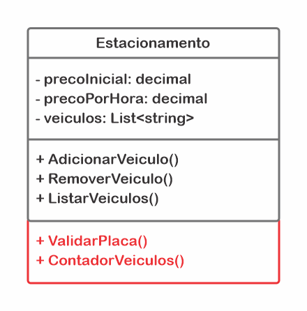

<h1 align="center" >DIO - Trilha .NET - Fundamentos</h1>

<b>PROJETO EDUCACIONAL PARA O BOOTCAMP DA DIO: </b>

**Desenvolvido por:** _Thiago de Oliveira Miranda_

---

 

## **Desafio de projeto**

&emsp;&emsp;Para este desafio, foi necessário usar os conhecimentos adquiridos no módulo de fundamentos, da trilha .NET da DIO.

 

## **Contexto**

&emsp;&emsp;Você foi contratado para construir um sistema para um **_estacionamento_**, que será usado para gerenciar os veículos estacionados e realizar suas operações, como por exemplo **_adicionar um veículo_**, **_remover um veículo_** (**_exibir o valor cobrado_** durante o período) e **_listar os veículos_**.

 

## **Proposta**

&emsp;&emsp;Construir uma classe chamada "Estacionamento", conforme o diagrama abaixo:

 

<i>Figura 01: Diagrama da classe Estacionamento.</i>

 

A classe contém três variáveis, sendo:

**precoInicial**: Tipo decimal. É o preço cobrado para deixar seu veículo estacionado.

**precoPorHora**: Tipo decimal. É o preço por hora que o veículo permanecer estacionado.

**veiculos**: É uma lista de string, representando uma coleção de veículos estacionados. Contém apenas a placa do veículo.

A classe continha inicialmente três métodos, sendo:

**AdicionarVeiculo**: Método responsável por receber uma placa digitada pelo usuário e guardar na variável **veiculos**.

**RemoverVeiculo**: Método responsável por verificar se um determinado veículo está estacionado, e caso positivo, irá pedir a quantidade de horas que ele permaneceu no estacionamento. Após isso, realiza o seguinte cálculo: **precoInicial** \* **precoPorHora**, exibindo para o usuário.

**ListarVeiculos**: Lista todos os veículos presentes atualmente no estacionamento. Caso não haja nenhum, exibir a mensagem "Não há veículos estacionados".

**ValidarPlaca:** Verifica se a placa foi inserida respeitando o padrão Mercosul: **AAA - 0A00**. Foi utilizada a biblioteca **_Regex_** com o parâmetro: **[A-Z]{3}-[0-9][0-9a-z][0-9]{2}** para a validação.

**ContadorVeiculos:** Verifica se há veículos no estacionamento e armazena a informação em uma variável.

Por último, foi feito um menu interativo com as seguintes ações implementadas:

 

Preço inicial = R$ 0,00

Preço por hora adicional = R$ 0,00

 

0 veículos estacionados.

_____________________________________

 

1) &nbsp; - &nbsp; Cadastrar veículo.

2) &nbsp; - &nbsp; Remover veículo.

3) &nbsp; - &nbsp; Listar veículos.

4) &nbsp; - &nbsp; Encerrar.

 

## Solução

&emsp;&emsp;Foram implementadas todas as soluções requisitadas no desafio, e outras soluções também foram exploradas para fins de aprendizado:

- [**x**] &emsp; Validação dos inputs do usuário, evitando dados nulos, vazios ou inválidos.

- [**x**] &emsp; Validação do input de placa dos veículos no padrão nacional.

- [**x**] &emsp; Informações de **_Preço inicial_**, **_Preço por hora_** e **_Número de veículos_** no menu principal.

* [**x**] &emsp; Lista de veículos no menu de **_Remover veículos_**.
